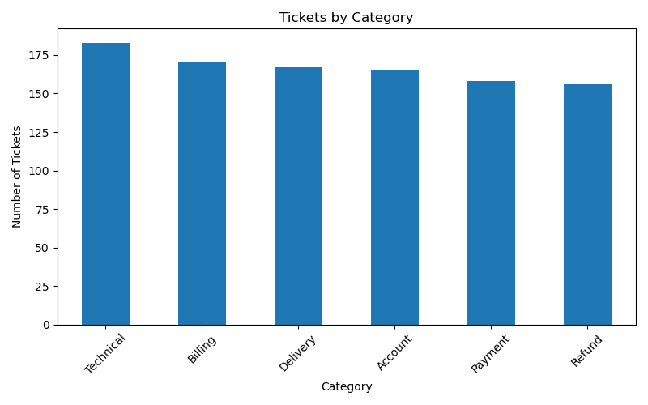
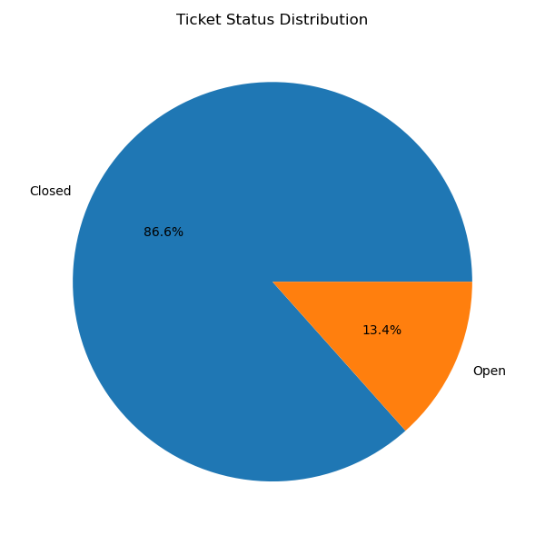
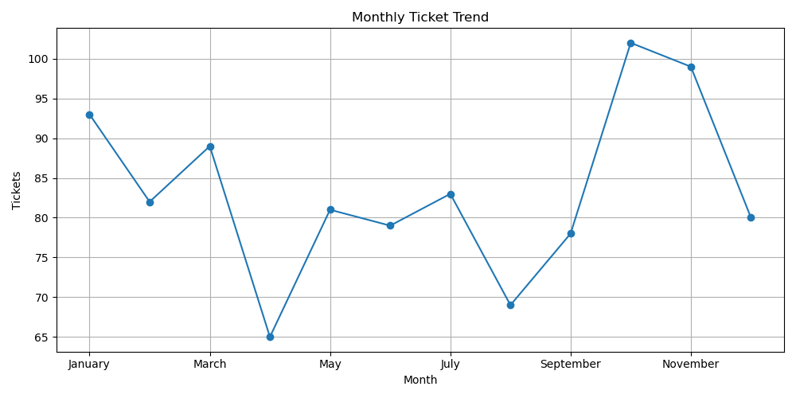
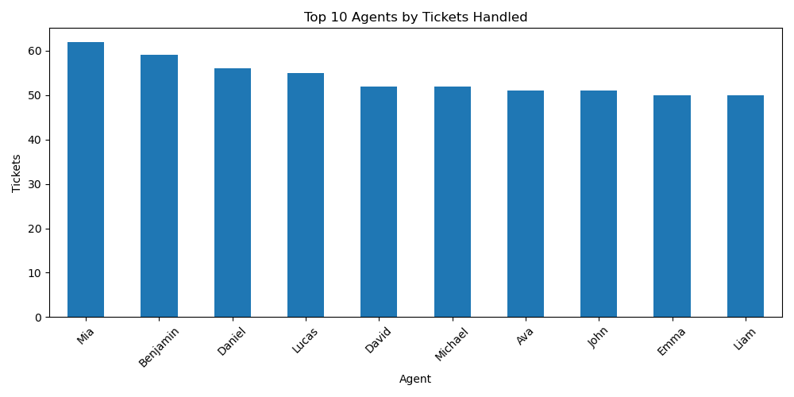
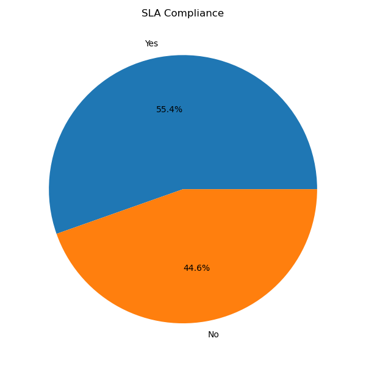
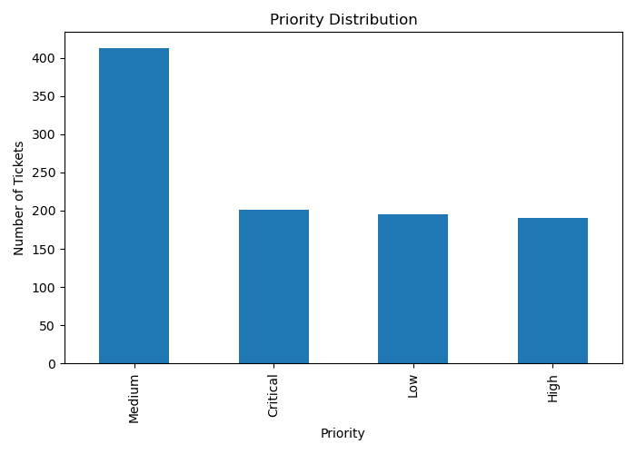
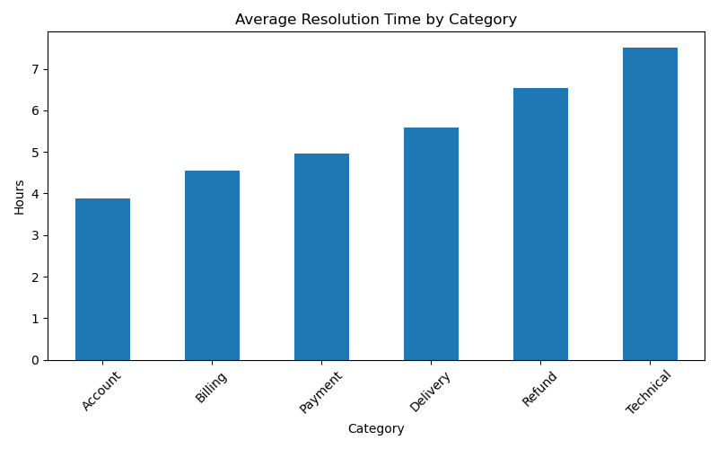
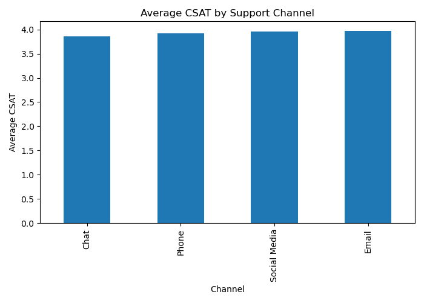

# 📊 Customer Support SQL & Python Analysis

An end-to-end **Data Analytics** project that analyzes customer support ticket data using **MySQL**, **SQL**, **Python**, and **Data Visualization** to generate actionable business insights.

---

## 🚀 Project Overview

Customer support teams generate thousands of tickets every month. This project analyzes customer support data to identify trends, evaluate agent performance, monitor SLA compliance, and measure customer satisfaction.

The project demonstrates the complete data analysis workflow:

- Database Design using MySQL
- SQL Analysis (Basic → Advanced)
- Business Case Studies
- Exploratory Data Analysis (EDA)
- Data Visualization using Python
- Business Insights & Recommendations

---

## 🛠️ Tech Stack

| Technology | Purpose |
|------------|---------|
| Python | Data Analysis |
| Pandas | Data Manipulation |
| MySQL | Database |
| SQL | Data Querying |
| SQLAlchemy | Database Connection |
| PyMySQL | MySQL Connector |
| Matplotlib | Visualization |
| Seaborn | Statistical Visualization |
| Jupyter Notebook | Development Environment |

---

# 📂 Project Structure

```text
Customer Support SQL Python Analysis/
│
├── SQL/
│   ├── 01_database_setup.sql
│   ├── 02_basic_queries.sql
│   ├── 03_intermediate_queries.sql
│   ├── 04_advanced_queries.sql
│   └── 05_business_case_study.sql
│
├── Python/
│   ├── mysql_import.ipynb
│   ├── eda_analysis.ipynb
│   └── visualization.ipynb
│
├── Dataset/
│
├── README.md
├── requirements.txt
└── LICENSE
```

---

# 📊 SQL Analysis

The SQL module includes more than **40 business-focused queries**, covering:

- Database Creation
- Table Creation
- Data Exploration
- Aggregate Functions
- GROUP BY
- ORDER BY
- CASE Statements
- Window Functions
- Common Table Expressions (CTEs)
- Subqueries
- Business Case Studies

---

# 🐍 Python Analysis

Python was used to:

- Connect to MySQL
- Import SQL tables into Pandas
- Perform Exploratory Data Analysis
- Analyze Missing Values
- Generate Summary Statistics
- Create Business Visualizations

---

# 📈 Sample Visualizations

## Tickets by Category



---

## Ticket Status Distribution



---

## Monthly Ticket Trend



---

## Top Support Agents



---

## SLA Compliance



---

## Priority Distribution



---

## Resolution Time by Category



---

## Average CSAT by Channel



---

# 💡 Key Business Insights

- Most support requests are concentrated in a few ticket categories.
- Resolution time differs across ticket categories.
- SLA compliance provides a measurable indicator of operational efficiency.
- Customer satisfaction varies across support channels.
- Ticket trends help identify peak workload periods.
- Agent performance can be measured using ticket volume and customer satisfaction.

---

# ▶️ How to Run This Project

### 1. Clone the repository

```bash
git clone https://github.com/lingeshwarieashwari-wq/customer-support-sql-python-analysis.git
```

### 2. Install dependencies

```bash
pip install -r requirements.txt
```

### 3. Create the database

Run:

```
SQL/01_database_setup.sql
```

### 4. Import the dataset

Run:

```
Python/mysql_import.ipynb
```

### 5. Execute the notebooks

- eda_analysis.ipynb
- visualization.ipynb

---

# 📌 Future Improvements

- Build an interactive Power BI dashboard
- Develop a machine learning model to predict ticket priority
- Create an automated reporting pipeline
- Deploy the project using Streamlit

---

# 👩‍💻 Author

**Lingeshwari M**

Data Analytics Enthusiast

**Skills**

- SQL
- Python
- Pandas
- MySQL
- Excel
- Power BI
- Data Visualization

---

⭐ If you found this project useful, consider giving it a star!
